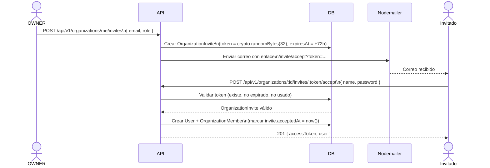
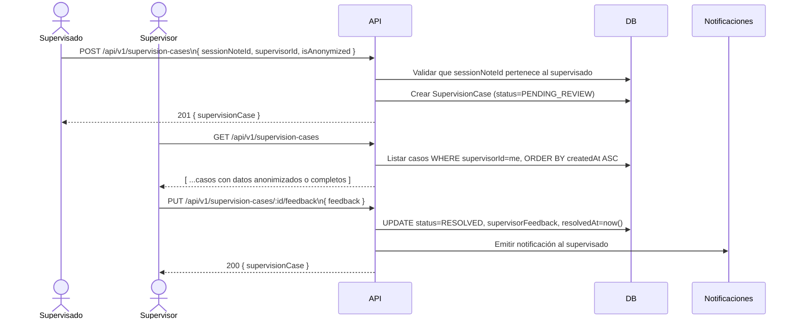

# 009 · Trabajo en Equipo y Supervisión — Plan

| Campo       | Valor                              |
|-------------|------------------------------------|
| **ID**      | 009                                |
| **Fase**    | 3                                  |
| **Estado**  | propuesta                          |
| **Fecha**   | 2026-06-30                         |

---

## 1. Enfoque general

Esta funcionalidad introduce el concepto de **Organización** como entidad de primer nivel que agrupa a múltiples usuarios profesionales. La estrategia de implementación se divide en tres pilares:

1. **Multi-tenancy por organización**: todos los datos clínicos (pacientes, citas, notas) quedan filtrados por `organizationId`. El `organizationId` viaja en el JWT del usuario autenticado y se aplica en capa de servicio, no en los controladores individualmente.
2. **Sistema de invitación segura**: flujo de token de un solo uso enviado por email para incorporar miembros sin exponer contraseñas.
3. **Supervisión clínica asíncrona**: un conjunto de entidades y endpoints específicos (`SupervisionCase`) que median el acceso controlado a notas clínicas entre supervisor y supervisado, con opción de anonimización.

> [!IMPORTANT]
> El aislamiento de datos entre terapeutas es un requisito de privacidad crítico. El filtro `organizationId + psychologistId` debe aplicarse en **todos** los servicios que acceden a datos de pacientes. No se confía únicamente en el frontend para ocultar datos.

---

## 2. Implementación

### 2.1 Base de datos — Nuevas tablas

#### `Organization`

```sql
CREATE TABLE "Organization" (
  id           UUID PRIMARY KEY DEFAULT gen_random_uuid(),
  name         TEXT NOT NULL,
  slug         TEXT NOT NULL UNIQUE,
  "ownerId"    UUID NOT NULL REFERENCES "User"(id),
  settings     JSONB NOT NULL DEFAULT '{}',
  "createdAt"  TIMESTAMPTZ NOT NULL DEFAULT now()
);
```

**`settings` JSONB — estructura:**
```jsonc
{
  "clinicName": "string",          // nombre visible de la clínica
  "logo": "string | null",         // URL Cloudinary/S3
  "primaryColor": "#RRGGBB",       // hex color de marca
  "defaultAppointmentDuration": 60, // minutos
  "address": "string | null",
  "phone": "string | null"
}
```

#### `OrganizationMember`

```sql
CREATE TABLE "OrganizationMember" (
  id               UUID PRIMARY KEY DEFAULT gen_random_uuid(),
  "organizationId" UUID NOT NULL REFERENCES "Organization"(id) ON DELETE CASCADE,
  "userId"         UUID NOT NULL REFERENCES "User"(id) ON DELETE CASCADE,
  role             TEXT NOT NULL CHECK (role IN ('OWNER','MEMBER','SUPERVISOR','ASSISTANT')),
  "invitedAt"      TIMESTAMPTZ,
  "joinedAt"       TIMESTAMPTZ,
  "isActive"       BOOLEAN NOT NULL DEFAULT true,
  UNIQUE ("organizationId", "userId")
);
CREATE INDEX ON "OrganizationMember" ("organizationId");
CREATE INDEX ON "OrganizationMember" ("userId");
```

#### `OrganizationInvite`

```sql
CREATE TABLE "OrganizationInvite" (
  id               UUID PRIMARY KEY DEFAULT gen_random_uuid(),
  "organizationId" UUID NOT NULL REFERENCES "Organization"(id) ON DELETE CASCADE,
  email            TEXT NOT NULL,
  role             TEXT NOT NULL CHECK (role IN ('MEMBER','SUPERVISOR','ASSISTANT')),
  token            TEXT NOT NULL UNIQUE,           -- crypto.randomBytes(32).toString('hex')
  "expiresAt"      TIMESTAMPTZ NOT NULL,           -- now() + 72 horas
  "acceptedAt"     TIMESTAMPTZ,                    -- NULL = pendiente
  "createdAt"      TIMESTAMPTZ NOT NULL DEFAULT now()
);
CREATE INDEX ON "OrganizationInvite" (token);
CREATE INDEX ON "OrganizationInvite" ("organizationId");
```

#### `SupervisionCase`

```sql
CREATE TABLE "SupervisionCase" (
  id                   UUID PRIMARY KEY DEFAULT gen_random_uuid(),
  "sessionNoteId"      UUID NOT NULL REFERENCES "SessionNote"(id),
  "supervisorId"       UUID NOT NULL REFERENCES "User"(id),
  "superviseeId"       UUID NOT NULL REFERENCES "User"(id),
  "organizationId"     UUID NOT NULL REFERENCES "Organization"(id) ON DELETE CASCADE,
  "isAnonymized"       BOOLEAN NOT NULL DEFAULT true,
  status               TEXT NOT NULL DEFAULT 'PENDING_REVIEW'
                         CHECK (status IN ('PENDING_REVIEW','IN_REVIEW','RESOLVED')),
  "supervisorFeedback" TEXT,
  "createdAt"          TIMESTAMPTZ NOT NULL DEFAULT now(),
  "resolvedAt"         TIMESTAMPTZ
);
CREATE INDEX ON "SupervisionCase" ("supervisorId", status);
CREATE INDEX ON "SupervisionCase" ("superviseeId");
CREATE INDEX ON "SupervisionCase" ("organizationId");
```

### 2.2 Modificaciones a tablas existentes

| Tabla | Columna añadida | Razón |
|---|---|---|
| `Patient` | `organizationId UUID REFERENCES Organization` | Anclar paciente a organización para filtros multi-tenancy |
| `Appointment` | `organizationId UUID REFERENCES Organization` | Idem |
| `SessionNote` | `organizationId UUID REFERENCES Organization` | Necesario para validar scope en supervisión |
| `User` | `activeOrganizationId UUID REFERENCES Organization` | Organización activa del usuario (para JWT) |

> [!NOTE]
> La columna `activeOrganizationId` permite que en el futuro se soporte multi-organización. Por ahora un usuario pertenece a una sola organización activa.

### 2.3 Control de acceso y JWT

Cuando un usuario se autentica, el payload del JWT incluye:

```jsonc
{
  "sub": "uuid-usuario",
  "role": "MEMBER",                         // rol global del sistema
  "orgId": "uuid-organization",             // organización activa
  "orgRole": "SUPERVISOR",                  // rol dentro de la organización
  "iat": 1234567890,
  "exp": 1234568790
}
```

**Regla de scope universal para datos clínicos:**

```
patient.organizationId = req.user.orgId
  AND (
    patient.psychologistId = req.user.id
    OR req.user.orgRole = 'SUPERVISOR'       -- supervisor puede ver casos de supervisión
    OR req.user.orgRole = 'OWNER'            -- owner puede ver todos (para control calidad)
  )
```

Este scope se implementa como un helper de Prisma (`buildPatientWhereClause(user)`) reutilizable en todos los servicios. **Nunca** se devuelven pacientes fuera del scope; si la consulta no encuentra registros, se responde `200 { data: [] }`, nunca `403`.

### 2.4 Flujo de invitación



**Validaciones del endpoint de aceptación:**
- Token existe y `acceptedAt IS NULL`
- `expiresAt > now()`
- El email no tiene ya una cuenta activa en esa organización
- Si el email ya existe como User global → solo crear OrganizationMember, no duplicar User

### 2.5 Flujo de supervisión



**Lógica de anonimización al responder:**
- Si `isAnonymized = true`: omitir `patient.fullName`, `patient.phone`, `patient.email`; reemplazar con `patientAlias = "Paciente #" + últimos 4 dígitos del patientId`.
- La anonimización se aplica en la capa de serialización del servicio, **no** almacenando datos alterados en DB.

### 2.6 API — Contratos de endpoints

#### Organizaciones

| Método | Ruta | Roles | Descripción |
|---|---|---|---|
| `POST` | `/api/v1/organizations` | PSYCHOLOGIST (global) | Crear organización (el creador se convierte en OWNER) |
| `GET` | `/api/v1/organizations/me` | Cualquier miembro | Obtener datos de la organización activa |
| `PUT` | `/api/v1/organizations/me` | OWNER | Actualizar nombre, slug, settings |
| `GET` | `/api/v1/organizations/me/members` | OWNER, SUPERVISOR | Listar miembros con rol y estado |
| `POST` | `/api/v1/organizations/me/invites` | OWNER | Crear invitación y enviar email |
| `GET` | `/api/v1/organizations/me/invites` | OWNER | Listar invitaciones pendientes |
| `DELETE` | `/api/v1/organizations/me/invites/:id` | OWNER | Revocar invitación pendiente |
| `PUT` | `/api/v1/organizations/me/members/:id` | OWNER | Cambiar rol o desactivar miembro |
| `POST` | `/api/v1/organizations/:id/invites/:token/accept` | Público | Aceptar invitación y crear cuenta |

#### Supervisión

| Método | Ruta | Roles | Descripción |
|---|---|---|---|
| `POST` | `/api/v1/supervision-cases` | MEMBER | Supervisado envía nota a supervisión |
| `GET` | `/api/v1/supervision-cases` | SUPERVISOR, OWNER | Ver cola de casos (SUPERVISOR: los suyos; OWNER: todos) |
| `GET` | `/api/v1/supervision-cases/:id` | SUPERVISOR, MEMBER dueño | Ver detalle del caso |
| `PUT` | `/api/v1/supervision-cases/:id/feedback` | SUPERVISOR | Agregar retroalimentación y cerrar caso |
| `PUT` | `/api/v1/supervision-cases/:id/status` | SUPERVISOR | Cambiar status (PENDING_REVIEW ↔ IN_REVIEW) |

#### Schemas Zod relevantes

```typescript
// Crear organización
const createOrgSchema = z.object({
  name: z.string().min(2).max(100),
  slug: z.string().min(2).max(50).regex(/^[a-z0-9-]+$/)
});

// Actualizar settings
const updateOrgSettingsSchema = z.object({
  clinicName: z.string().max(100).optional(),
  logo: z.string().url().optional().nullable(),
  primaryColor: z.string().regex(/^#[0-9A-Fa-f]{6}$/).optional(),
  defaultAppointmentDuration: z.number().int().min(15).max(240).optional(),
  address: z.string().max(255).optional().nullable(),
  phone: z.string().max(20).optional().nullable()
});

// Enviar invitación
const createInviteSchema = z.object({
  email: z.string().email(),
  role: z.enum(['MEMBER', 'SUPERVISOR', 'ASSISTANT'])
});

// Aceptar invitación
const acceptInviteSchema = z.object({
  name: z.string().min(2).max(100),
  password: z.string().min(8)
});

// Crear caso de supervisión
const createSupervisionCaseSchema = z.object({
  sessionNoteId: z.string().uuid(),
  supervisorId: z.string().uuid(),
  isAnonymized: z.boolean().default(true)
});

// Feedback del supervisor
const supervisorFeedbackSchema = z.object({
  feedback: z.string().min(10).max(5000)
});
```

### 2.7 Arquitectura React — Componentes

```
src/
  pages/
    organization/
      OrganizationSettingsPage.jsx       # OWNER: nombre, logo, color, settings
      MemberManagementPage.jsx           # OWNER: tabla de miembros, invitar, cambiar rol
      InviteAcceptPage.jsx               # Público: form para aceptar invitación por token
    supervision/
      SupervisionQueuePage.jsx           # SUPERVISOR: lista de casos pendientes
      SupervisionCaseFeedbackPage.jsx    # SUPERVISOR: detalle + form de retroalimentación
  components/
    organization/
      MemberTable.jsx                    # Tabla con paginación de miembros
      InviteMemberModal.jsx              # Modal: email + role selector + enviar
      ChangeMemberRoleModal.jsx          # Modal: cambiar rol o desactivar
      OrgSettingsForm.jsx                # Form con react-hook-form para settings
      LogoUploader.jsx                   # Cloudinary upload widget
    supervision/
      SupervisionCaseCard.jsx            # Tarjeta en la cola del supervisor
      SubmitForSupervisionModal.jsx      # MEMBER: selector de nota, supervisor y toggle anonimizar
      FeedbackForm.jsx                   # Textarea de retroalimentación del supervisor
      AnonymizedPatientBadge.jsx         # Badge visual cuando el caso está anonimizado
```

**Flujo de estado (React Query / Context):**
- `useOrganization()`: hook que expone los datos de la organización activa, membresía y rol del usuario.
- `useSupervisionCases(filters)`: hook con React Query para la cola de supervisión, con invalidación al enviar retroalimentación.
- El `orgRole` del usuario proviene del JWT decodificado y se almacena en `AuthContext`.

---

## 3. Decisiones técnicas

| # | Decisión | Alternativa descartada | Razón |
|---|---|---|---|
| D-01 | El `organizationId` y `orgRole` viajan en el JWT | Consultar DB en cada request | Evita latencia adicional; el token se invalida al desactivar miembro (refresh token rotation) |
| D-02 | Slug único por organización | Solo usar UUID en URLs | Permite URLs amigables (`/org/clinica-bienestar/...`) y facilita branding |
| D-03 | Token de invitación como hex de 32 bytes (256 bits) en DB | JWT firmado para invitación | Simplicidad: un token opaco es más fácil de revocar (solo borrar o marcar) |
| D-04 | Anonimización en capa de serialización (servicio) | Datos anonimizados en DB | Preserva integridad referencial; la decisión de mostrar nombre puede cambiar sin migración |
| D-05 | `SupervisionCase` referencia `SessionNote`, no `Patient` | Compartir registro clínico completo | Limita exposición: solo la nota específica, no el historial completo del paciente |
| D-06 | Rol OWNER no puede ser removido por otros OWNER | Permitir múltiples OWNER | Simplifica gobernanza; si el OWNER quiere transferir, lo hace desde configuración |
| D-07 | Invitación expira en 72 horas | 24 horas | Equilibrio entre seguridad y UX (contempla fines de semana) |
| D-08 | `isActive = false` desactiva acceso inmediatamente | Eliminar registro de OrganizationMember | Preserva auditoría y datos históricos |

---

## 4. Riesgos

| Riesgo | Probabilidad | Impacto | Mitigación |
|---|---|---|---|
| Fuga de datos entre terapeutas por error en el filtro de scope | Media | **Crítico** | Unit tests que validan el filtro con fixtures de múltiples terapeutas; revisión de código obligatoria para cualquier servicio de pacientes |
| Token de invitación interceptado en tránsito | Baja | Alto | Forzar HTTPS; token de un solo uso; expiración corta |
| Supervisor accede a datos no anonimizados sin consentimiento del paciente | Media | Alto | Validar en backend el campo `patient.consentedToSupervision` antes de `isAnonymized = false` |
| Degradación de rendimiento en organizaciones grandes (>100 miembros) | Baja | Medio | Índices en `OrganizationMember(organizationId)` y paginación en endpoint de miembros |
| OWNER desactivado bloquea la organización entera | Media | Alto | Verificar que siempre haya al menos un OWNER activo antes de desactivar; mostrar advertencia en UI |
| Token de invitación reutilizado por error (race condition) | Baja | Medio | Marcar `acceptedAt` en transacción atómica con check de `WHERE acceptedAt IS NULL` |
